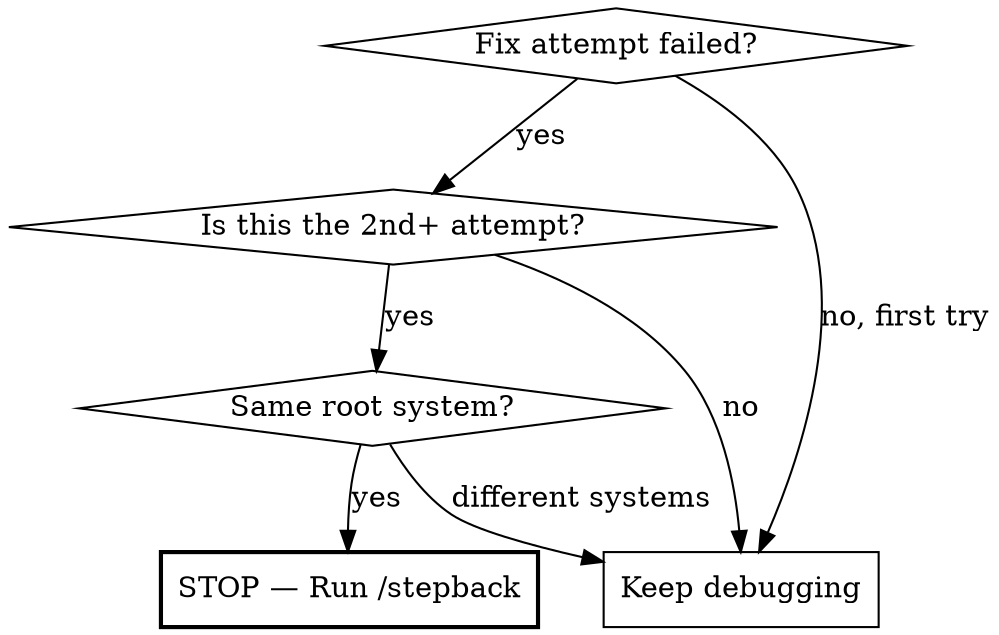

# Stepback - Strategic Reassessment

**Core principle:** If you've tried 2+ fixes for the same class of problem, you're probably patching symptoms. Stop. Zoom out. Research the architecture.

## When to Trigger



**Symptoms that demand /stepback:**
- Same error returns after a "fix"
- Fix A reveals error B reveals error C (cascade)
- Locally it works, deployed it doesn't
- Multiple components broken by the same underlying cause
- Fixes feel like whack-a-mole

**Proactive triggers (don't wait for failure):**
- Touching deployment config, build pipeline, or infrastructure
- Changing middleware, routing, or auth at the platform level
- Modifying `next.config.js`, `vercel.json`, Dockerfile, CI/CD

## Execution

### STEP 1 — Stop and Inventory

List every fix attempt so far in this session. For each:
- What symptom it addressed
- Whether it worked or revealed a new symptom
- What assumption it was based on

Present this to the user as a table:

```markdown
| # | Fix | Symptom | Result | Assumption |
|---|-----|---------|--------|------------|
| 1 | Added route to middleware whitelist | 405 on webhook | Still 405 | Middleware was blocking |
| 2 | Replaced parseBody with manual HMAC | 500 crash | Still 500 | parseBody incompatible |
| 3 | ... | ... | ... | ... |
```

### STEP 2 — Find the Common Thread

Ask: **"What system do ALL of these symptoms share?"**

Don't look at each symptom individually. Look for:
- Shared infrastructure (build system, deployment platform, DNS)
- Shared config (one file that affects everything)
- Shared assumption (e.g., "the code is running" when it isn't)

### STEP 3 — Research the Architecture

Spawn a research agent (Perplexity) with THREE queries:
1. "Common causes of [shared symptom pattern] in [platform/framework]"
2. "[Platform] [framework] deployment issues [year]"
3. "[Specific error pattern] works locally fails in production [platform]"

This is mandatory. No skipping research because "I think I know."

### STEP 4 — Test the Broadest Hypothesis First

Instead of testing your specific broken feature, test whether the ENTIRE CLASS of features works:

```markdown
Before: "Does /api/revalidate work?"
After:  "Does ANY API route work on production?"
```

If the broader test fails, you've found a systemic issue — fix THAT, not the individual symptom.

### STEP 5 — Present the Choice

Show the user:

```markdown
**Symptom-level fix:** [what you've been doing]
**Architecture-level fix:** [what research suggests]
**Effort comparison:** [patch N symptoms vs fix 1 root cause]
**Recommendation:** [which approach and why]
```

Let the user decide. Don't assume redesign is always better — sometimes patching IS correct.

## Red Flags — You're Symptom-Patching If:

| Signal | What It Means |
|--------|---------------|
| "Let me just try one more thing" | You're guessing, not diagnosing |
| "This fix should definitely work" | You said that last time |
| "It works locally" | Local ≠ production. Check the deployment pipeline |
| "I'll add this to the whitelist/allowlist" | You're growing a list instead of questioning the filter |
| "The code is correct, something else is wrong" | Check if the code is even RUNNING |
| 3+ commits with "fix:" in a row | Pattern detected — step back |

## The Outsider Test

When running /stepback, pretend you're a new consultant reviewing this system for the first time. Ask:

1. "What is different about this setup compared to a standard one?"
2. "What would a fresh install look like?"
3. "What was added/customized that might be causing this?"

The answer is almost always in the DELTA between standard and custom.

## Real-World Example

**Session 2026-02-13 — Atlas Website webhook**

5 fix attempts over 2 hours: middleware whitelist, parseBody replacement, CSP headers, dead component cleanup, deployment protection check. All were real issues but none were THE issue.

The outsider test revealed: `outputFileTracingRoot` in `next.config.js` was set to a hardcoded local path (`/home/anombyte/Atlas/Atlas_Website`). On Vercel's build server, this path doesn't exist, so Next.js silently generated ZERO serverless functions. No API routes worked — not just the webhook.

One line removed. Everything worked.

**The 5 "fixes" were real improvements** (cleaner middleware, better CSP, removed dead code) — but they would have taken 10 minutes as planned cleanup, not 2 hours of confused debugging.
